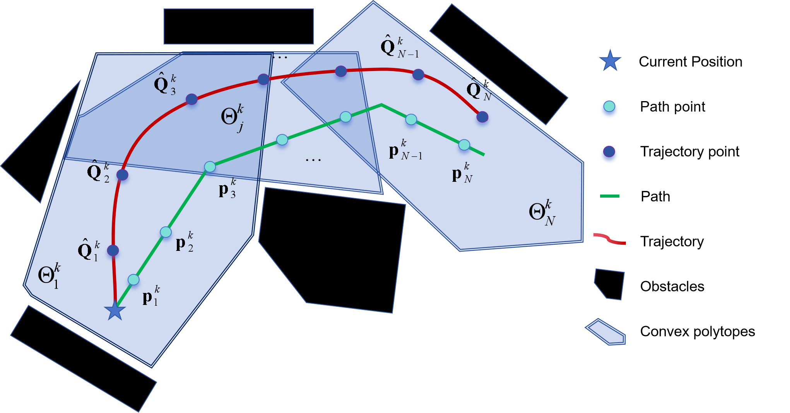
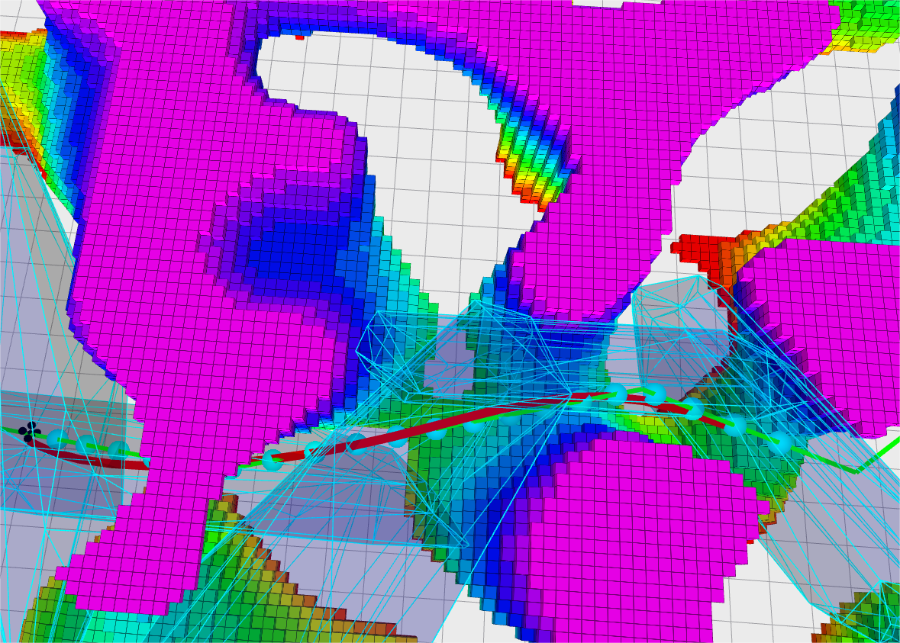

# PMPCC

**PMPPC**: **P**ath based **M**odel **P**redictive **P**lanning and **C**ontrol

<p align="center">
  
  
  
</p>

## 1 Prerequisites

### 1.1 Ubuntu and Ros

Our software is developed in Ubuntu 20.04. ROS Noetic. ROS can be installed here: [ROS Installation](http://wiki.ros.org/ROS/Installation)

### 1.2 ompl and eigen
```
sudo apt update
sudo apt install libompl-dev
sudo apt-get install libeigen3-dev
```
### 1.3 qpOASES
```
mkdir pmppc_lib && cd pmppc_lib
git clone https://github.com/coin-or/qpOASES.git
cd qpOASES
mkdir build && cd build
cmake ..
sudo make
sudo make install
```


## 2 Quick start
```
git clone https://github.com/Rax0913/PMPPC.git
cd PMPPC
catkin_make
source ./devel/setup.bash
roslaunch pmppc_planner global_planning.launch
```
Select ***"2D Nav Goal"*** to set waypoints and a path(the green line) will be searched in the map, then the planning and control will be completed by the algorithm.

## 3 Acknowledgements
  We use **qpOASES** for QP optimization.

## 4 Licence
The source code is released under [GPLv3](http://www.gnu.org/licenses/) license.


## 5 Disclaimer
This is research code, it is distributed in the hope that it will be useful, but WITHOUT ANY WARRANTY; without even the implied warranty of merchantability or fitness for a particular purpose.